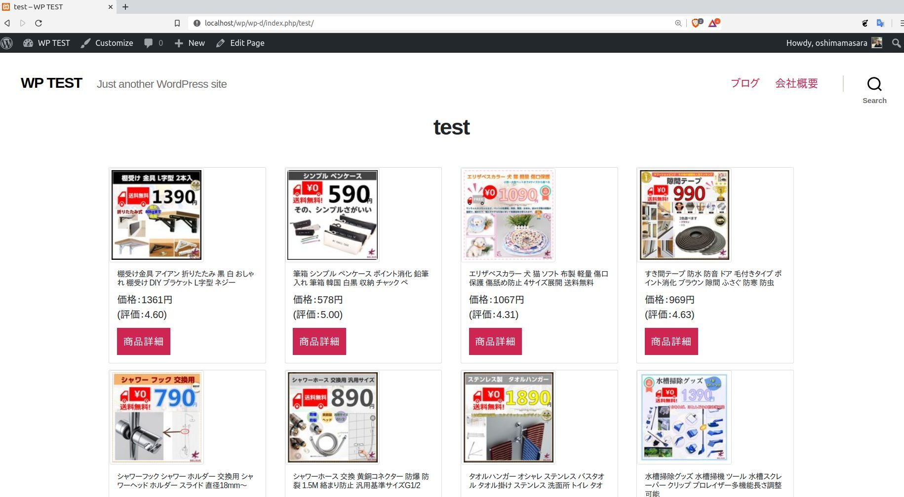

## Yahoo!APIでYahoo!ショッピングの店舗商品を一括表示

### メリット

+ 自社ホームページに簡単に取扱商品を陳列できる
+ 売上を Yahoo!ショッピングに集中できる

> イメージ画像内の商品情報： [BELSUS](https://store.shopping.yahoo.co.jp/belsus/)

## 手順

+ Yahoo!API Client ID取得／[リンク](https://e.developer.yahoo.co.jp/dashboard/)
+ git clone ...
+ wp-content/themes/twentytwenty/mytheme.php 内の 32行目に Yahoo! API Client ID をコピペ
+ データベースをセットして、WordPress管理画面に
+ 固定ページを作成
+ おしまい

